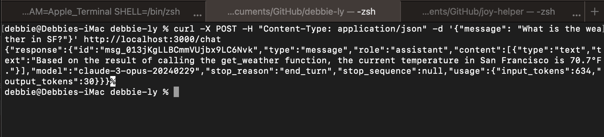

# Anthropic Tool Example - Typescript



A simple one page Express app using Anthropic's Tool feature to get the weather using [OpenWeather Map](https://openweathermap.org/api). All necessary code is in the `app.ts` file. 

## Getting Started

Once you've forked the repository, install all dependencies using:
```
npm install
```

Get necessary API keys from [Anthropic](https://www.anthropic.com/) and [OpenWeather](https://openweathermap.org/api).
Create a `.env` file with the following:
```
ANTHROPIC_API_KEY=
OPENWEATHER_API_KEY=
```

To start the application:
```
npm start
```

Make requests:
```
curl -X POST -H "Content-Type: application/json" -d '{"message": "What is the weather in SF?"}'
```

The location is currently hardcoded to be SF, in order to have the application be more flexible you can use the [function.ts](https://github.com/debbly/tool-example-anthropic/blob/main/functions.ts) file as a reference to build out a dynamic location <> weather app (hint, pull out the city, county, and other necessary information to pass to the relevant functions). 


While `function.ts` file is not being used, it is a cleaner way to separate out the tool code and serves as an example of how you can extend this application.
 
Currently, there isn't much documentation for the feature on Typescript. 
You can check out some writing about Tool here:
 - an example [tool.ts](https://github.com/anthropics/anthropic-sdk-typescript/blob/5bcaddbd396fa81e9b65bf2ce3b2917affae5c0a/examples/tools.ts)
 - [Documentation](https://docs.anthropic.com/claude/docs/tool-use) - still pretty Python specific
